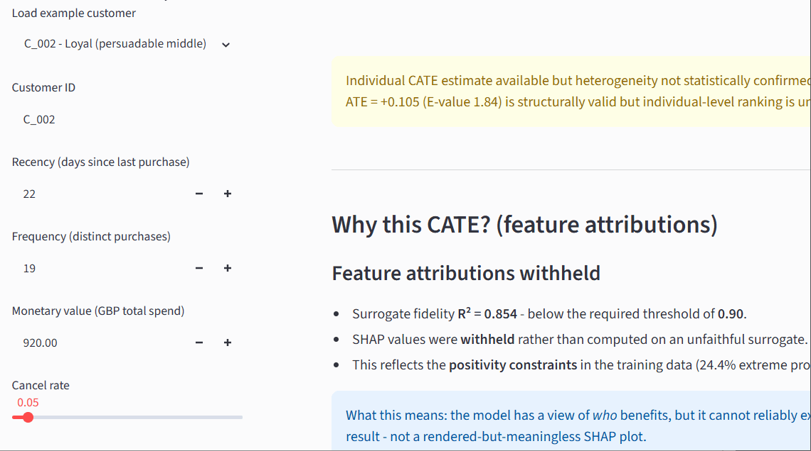

# Customer Lifetime Value Uplift Modeling

> A production-grade causal inference service that estimates the *incremental* effect of a marketing contact on customer conversion — and knows when not to act on it.


---

## Demo




📓 [**View the pre-run demo notebook**](notebooks/02_demo.ipynb) — fully rendered, no setup required.

---

## Problem Statement

A retailer contacts a subset of customers with a marketing intervention and wants to know: *did it work, and for whom?* The tempting answer is to compare the conversion rate of contacted customers against everyone else. On this data that naive comparison gives a **+0.334** difference — a seemingly large lift.

That number is a trap. Customers were not contacted at random; they were contacted *because* they were already more engaged — more recent, higher-spending, more frequent. The naive difference therefore conflates the effect of the contact with the pre-existing differences between the two groups. It measures **association**, not **causation**, and acting on it would massively overstate the value of the campaign.

This project applies double machine learning (a `CausalForestDML`) to remove that selection bias. After adjusting for the confounders that drive *both* who gets contacted and who converts, the true average treatment effect is **+0.105** — roughly a third of the naive figure. The **+0.229** gap between them is the confounding that the naive analysis would have billed as campaign value. Recovering that gap, quantifying its uncertainty, and stress-testing it is the core of the pipeline.

---

## Architecture

```
                          UCI Online Retail II (541,910 transactions)
                                          |
                                          v
   +------------------------------------------------------------------+
   |  DATA PIPELINE  (src/clv_uplift/data, features)                  |
   |    clean_transactions  ->  build_rfm  ->  assign_clv_segment     |
   |    ->  create_synthetic_treatment  ->  stratified split          |
   |    (4,334 customers; recency/frequency/monetary + r/f/m scores)  |
   +------------------------------------------------------------------+
                                          |
                                          v
   +------------------------------------------------------------------+
   |  CAUSAL ENGINE  (src/clv_uplift/models)                          |
   |    diagnostics   propensity overlap, calibration, SMD            |
   |    uplift        CausalForestDML (primary) + S/T/X-learners      |
   |    validation    RATE/AUTOC, 4 DoWhy refuters, E-value           |
   |    explain       surrogate SHAP behind an R^2 fidelity gate      |
   |    policy        GATE-by-segment, geographic fairness audit      |
   +------------------------------------------------------------------+
                                          |
                          pickled ServingBundle (artifacts/uplift_model.pkl)
                                          |
                  +-----------------------+-----------------------+
                  v                                               v
   +---------------------------------+        +---------------------------------+
   |  FastAPI  (src/clv_uplift/api)  |  <---- |  Streamlit  (streamlit_app)     |
   |    /health                      |        |    model-context panel          |
   |    /api/v1/score   (scaffold)   |        |    CATE + CI error-bar chart    |
   |    /api/v1/predict (real CATE)  |        |    honest degraded explanation  |
   |    /api/v1/explain (SHAP/gate)  |        |                                 |
   |    /api/v1/model-info           |        |                                 |
   +---------------------------------+        +---------------------------------+
                  \___________________  Docker Compose  ___________________/
```

---

## Results

All estimates are on the held-out test set (867 customers), seed 42. The meta-learners and the primary forest converge on the same corrected effect; only the forest carries valid individual-level confidence intervals.

| Estimator | Estimand | Effect | Note |
|---|---|---|---|
| Naive difference | association | **+0.334** | confounded — NOT causal |
| S-Learner | ATE baseline | +0.096 | single model, treatment as feature |
| T-Learner | ATE baseline | +0.107 | per-arm models |
| X-Learner | ATE/ATO-adjacent | +0.123 | propensity-weighted combiner |
| **CausalForestDML** | **ATE (primary)** | **+0.105** | 95% CI [−0.206, +0.415]; individual CIs |
| **Confounding correction** | naive − causal | **+0.229** | the bias the naive analysis would bill as value |

The four estimators landing in a tight +0.10–0.12 band — well below the naive +0.334 — is the central demonstration: the confounding correction is real and consistent across methods.

---

## Tiered Findings

The project reports findings at the confidence level the evidence actually supports — not all-or-nothing.

**Tier 1 — Structural validity: CONFIRMED.** The causal claim survives all four DoWhy refuters. The placebo-treatment test (the hard gate) returns an effect near zero, confirming the pipeline does not manufacture an effect from noise; random-common-cause, data-subset, and bootstrap refuters all report stable estimates.

**Tier 2 — Average effect: REAL AND ROBUST.** The ATE of +0.105 is consistent across five estimators and carries a point **E-value of 1.84** — an unmeasured confounder would need a risk ratio of at least 1.84 with both treatment and outcome to explain it away. The direction and magnitude are sound.

**Tier 3 — Individual heterogeneity: NOT CONFIRMED (the headline finding).** The RATE/AUTOC test for whether the model's CATE ranking captures *real* heterogeneity could not reject the null at 95%. So:

> **The average treatment effect is real and robust (Tier 2, E-value 1.84). Individual-level heterogeneity was not statistically confirmed (Tier 3, RATE null). The pipeline correctly withheld the targeting policy and the SHAP attributions rather than act on unconfirmed signal. This discipline — knowing the difference between "an effect exists" and "I can target it" — is the project's primary methodological contribution.**

### The four-consequence chain

A single root cause — **positivity strain** (≈24% of customers have extreme propensity scores below 0.05 or above 0.95) — propagates into four coherent consequences. They are one data limitation seen from four angles, not four separate failures:

1. **Wide ATE confidence interval** — [−0.206, +0.415], spanning zero, despite a sound point estimate. Limited overlap inflates the variance of any causal estimate.
2. **CI-bound E-value of 1.00** — because the CI already contains the null, no hidden confounding is required to make the average effect non-significant; the sensitivity analysis reflects the same overlap limitation.
3. **RATE / AUTOC null** — the CATE ranking has structure but does not rise above noise strongly enough to certify individual targeting.
4. **Surrogate fidelity below the gate (R² = 0.85 < 0.90)** — the interpretable surrogate cannot faithfully approximate the forest's CATE function, so SHAP attributions are **withheld** rather than computed on an unfaithful surrogate.

The disciplined response — report the robust population effect, refuse to ship a targeting policy on uncertified heterogeneity, and withhold explanations the model can't support — is exactly what the service does. Restoring positivity (a less selective contact policy, or more holdout data) is the path to certifying the remaining tiers.

---

## Quickstart

### Option A — Docker (full stack: API + dashboard)

```bash
# 1. Build the images
docker compose build

# 2. Train the model inside the container (writes artifacts/uplift_model.pkl)
bash scripts/train_in_docker.sh

# 3. Launch the API (port 8000) and the Streamlit dashboard (port 8501)
docker compose up
```

Then open the **dashboard at** `http://localhost:8501` and the **API docs at** `http://localhost:8000/docs`. Stop with `Ctrl+C`, then `docker compose down`.

### Option B — Local (Python 3.11)

```bash
python -m venv .venv
.venv\Scripts\Activate.ps1          # Windows;  source .venv/bin/activate on Unix
pip install -e ".[dev]"

# Train (requires data/raw/online_retail_II.xlsx)
python notebooks/01_uplift_training.py

# Serve
uvicorn clv_uplift.api.main:app --reload
streamlit run streamlit_app/app.py
```

### Option C — Zero-friction CLI demo (no data, no Docker)

```bash
python scripts/run_demo.py
```

Loads the trained bundle and prints the population findings plus CATE estimates for five example customers in seconds.

---

## Technical Highlights

- **Modal-lookup RFM binner.** Serving-time quartile scoring reproduces training exactly by recording the majority score per distinct training value, avoiding the bin-collapse that naive value-quantile cutpoints suffer on heavily-tied integer features (e.g. frequency). The binner travels inside the model bundle, so the API needs no knowledge of training-distribution cutpoints and stays retrain-safe.
- **Surrogate-SHAP fidelity gate.** Explanations are computed on an interpretable surrogate only if it faithfully approximates the forest (R² > 0.90). Below the gate, `/explain` returns HTTP 200 with `explanation_available=false` and the specific reason — an honest withholding, not a server error and not a misleading attribution.
- **RATE as a hard targeting gate.** Whether the pipeline ships an individual-targeting policy is gated structurally on the RATE test, not left to a comment. Because the test returns a null, no `PolicyTree` is built or even imported.
- **Individual confidence intervals.** The `CausalForestDML` is fit with `honest=True, inference=True`, so every served CATE carries a valid 95% interval via `effect_interval` — the basis for the dashboard's per-customer error bars and the not-for-targeting flag.

---

## Limitations

1. **Positivity strain.** ≈24% of customers sit at extreme propensities. This is the root cause behind the wide ATE CI, the CI-bound E-value of 1.00, the RATE null, and the sub-threshold surrogate. It is documented, not hidden.
2. **RATE null / no certified targeting.** Individual heterogeneity is not statistically confirmed; CATE estimates are returned but explicitly flagged not-for-targeting.
3. **E-value sensitivity.** The point E-value (1.84) is non-trivial, but the CI-bound E-value of 1.00 means the average effect's significance is conditional on the overlap available.
4. **Synthetic treatment & outcome.** The UCI dataset has no real treatment assignment, so treatment and outcome are simulated with a *stochastic* (sigmoid-propensity) design that preserves confounding while restoring overlap. The causal *machinery* is real and production-grade; the ground-truth effect is engineered for demonstration.
5. **No legally protected attributes.** The dataset contains none, so the fairness audit is a *geographic-equity* analysis (targeting rates by country), framed prospectively since no policy is deployed.

---

## Reproducibility

Deterministic under seed **42** across the full pipeline.

**Local stack:** Python 3.11.9 · econml 0.16.0 · dowhy 0.14 · shap 0.48 · scikit-learn 1.6.1 · lightgbm 4.6.0 · numpy 2.x · statsmodels 0.14

**Container stack:** identical except scipy 1.15.3 and pandas 3.x; ABI parity verified — all decision-bearing numbers are bit-identical to the local run.

**Corrected library signatures** encountered and pinned during development (documented inline):
- `CausalForestDML` requires `discrete_outcome=True` for a classifier `model_y` (otherwise residualizes on hard labels).
- `DRTester` accepts `metric='toc'` (not `'autoc'`) in econml 0.16, and needs a 1-D effect proxy when `discrete_outcome=True`.
- numpy 2.x: size-1 non-0-d arrays require explicit `.reshape(-1)[0]` extraction, not `float()`.
- `PreFittedPropensity` overrides `__sklearn_clone__` to preserve the calibrated inner model through econml's internal cloning.

---

## Project Structure

```
clv-uplift/
├── src/clv_uplift/
│   ├── config.py                 # all constants (BREAKEVEN_CATE, FEATURE_COLS, paths)
│   ├── data/                     # audit.py (load_raw), loader.py (clean_transactions)
│   ├── features/rfm.py           # RFM, segments, synthetic treatment, split, RFMBinner
│   ├── models/
│   │   ├── diagnostics.py        # propensity overlap, calibration
│   │   ├── uplift.py             # CausalForestDML + S/T/X learners
│   │   ├── validation.py         # RATE, 4 refuters, E-value
│   │   ├── explain.py            # surrogate SHAP + fidelity gate
│   │   ├── policy.py             # GATE, fairness audit
│   │   └── serving.py            # ServingBundle + load_bundle
│   └── api/
│       ├── main.py               # FastAPI app (lifespan warmup)
│       ├── dependencies.py       # get_model / get_bundle / require_bundle
│       ├── schemas.py            # Pydantic v2 contracts
│       └── routers/              # health, predict, explain, info
├── streamlit_app/                # dashboard + its Dockerfile
├── scripts/                      # train_in_docker, generate_examples, run_demo, build_demo_notebook
├── notebooks/                    # 01_uplift_training.py, 02_demo.ipynb
├── examples/                     # sample_customers.json + sample API responses
├── artifacts/figures/            # committed diagnostic figures
├── tests/test_api.py             # 7 contract tests
├── Dockerfile · docker-compose.yml · pyproject.toml · LICENSE
```

---

## Dataset

[UCI Online Retail II](https://archive.ics.uci.edu/dataset/502/online+retail+ii) — 541,910 transactions from a UK-based online retailer (2009–2011). Cleaning removes cancellations, missing customer IDs, non-product stock codes, and non-positive prices/quantities, yielding **396,337 transactions across 4,334 customers**. Place the workbook at `data/raw/online_retail_II.xlsx` to run training locally.

---

## Citation / Contact

```bibtex
@software{gharibi_clv_uplift,
  author = {Amirhossein Gharibi},
  title  = {Customer Lifetime Value Uplift Modeling},
  year   = {2026},
  url    = {https://github.com/Amirhossein-gharibi/clv-uplift}
}
```

**Author:** Amirhossein Gharibi · [github.com/Amirhossein-gharibi](https://github.com/Amirhossein-gharibi)

Licensed under the [MIT License](LICENSE).
